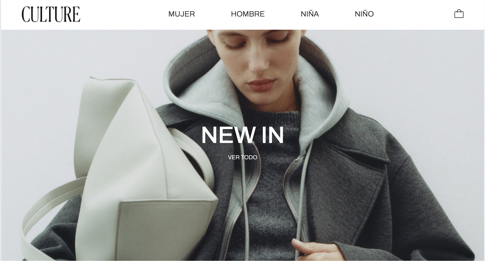

# CULTURE 🛍️

Desarrollo de una tienda online para la venta de productos, con funcionalidades como navegación por categorías, carrito de compras dinámico y sistema de órdenes.

### Instalación ⚙️

- Clone el repositorio.
- Ejecute npm install para instalar dependencias y crear la carpeta node_modules.
- Ejecute npm run dev para levantar el proyecto en el servidor local.

### Version HOST 💻

[Culture](url de versel)

### Librerias utilizadas 📖

- [Bootstrap](https://getbootstrap.com/): utilizada para el styling de la app.
- [React Bootstrap](https://react-bootstrap.netlify.app/): utilizada para el styling de la app.
- [Firebase](https://firebase.google.com/?hl=es-419): utilizada como base de datos.
- [React Router Dom](https://reactrouter.com/): utilizada para la navegación por rutas.
- [React Spinners](https://www.npmjs.com/package/react-spinners): utilizada para implementar componente spinner.
- [React Hook Form](https://react-hook-form.com/): utilizada para la validación de formularios.

# Desarrollada por Florencia Mussis